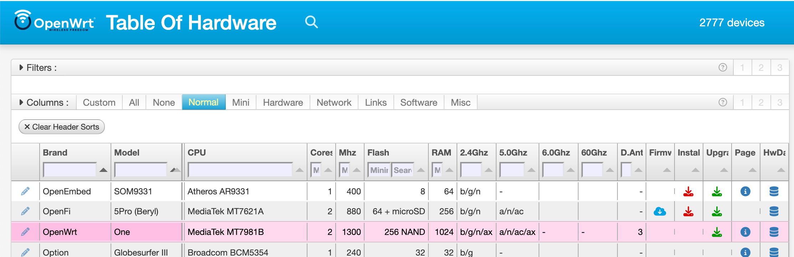

# OpenWrt Table of Hardware (ToH)
_A Smart, Fast Hardware Database for OpenWrt_

The **OpenWrt Table of Hardware (ToH)** is live at
[https://toh.openwrt.org/](https://toh.openwrt.org).
It delivers accurate, easily searchable hardware compatibility data, replacing an earlier slow, cumbersome facility.

As shown in the image above, the ToH displays a table of technical information about each router.

The development version of the ToH is live [here at Github](https://openwrt.github.io/toh-openwrt-org/).

## Overview

The ToH pages reads the `toh.json` file from
[https://openwrt.org/toh.json](https://openwrt.org/toh.json) to get the values in the table.

The `toh.json` file is created by a nightly process that scans all the pages from the [Hardware Data](https://openwrt.org/toh/hwdata/start) section of the [OpenWrt Wiki](https://openwrt.org). These pages are user-maintained, and include the best-available information about each device/router.

## How to Contribute  

The ToH code is maintained in [its Github repo](https://github.com/openwrt/toh-openwrt-org). We welcome developers, designers, and OpenWrt enthusiasts to help improve the ToH. Whether you want to refine data parsing, enhance the user interface, or optimize performance, your contributions are invaluable. Here’s how you can get involved:

- **Submit Pull Requests** – Implement fixes, introduce features, or improve efficiency.  
- **Report Issues** – Identify bugs, suggest enhancements, or provide feedback.  
- **Enhance Hardware Data pages** – Help refine the source data for better accuracy and usability.  

Fork the repository, refine the code, and submit a pull request (to the **develop** branch). Together, we can build a robust, user-friendly ToH that benefits the entire OpenWrt community.

Thanks.
